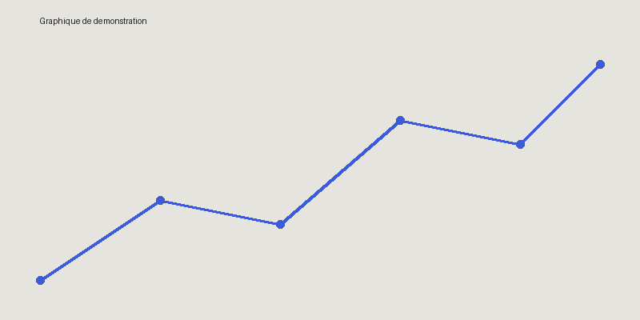

# Introduction

Cette étude démontre le rendu du système de publication. Elle couvre l'évolution des concentrations de particules fines observées entre 1990 et 2020 dans plusieurs zones urbaines.

## Contexte

La qualité de l'air s'est **nettement améliorée** dans la majorité des zones étudiées, bien que des disparités *régionales* persistent. Cette analyse s'appuie sur :

- des relevés de stations de mesure au sol ;
- des données satellitaires ;
- des modèles de dispersion atmosphérique.

## Données

Voici un tableau synthétisant l'évolution :

| Année | Valeur (µg/m³) |
|---|---:|
| 1990 | 100 |
| 2000 | 87 |
| 2010 | 72 |
| 2020 | 54 |

## Équation

La relation masse-énergie sert ici de rappel méthodologique pour les calculs d'incertitude :

$$
E = mc^2
$$

On peut aussi noter une variable inline comme $\sigma^2$ dans le texte courant.

## Graphique



## Code

```python
data = [100, 87, 72, 54]
print(data)
```

Un exemple de code inline : `print("Hello")`.

## Citation

> La qualité de l'air urbain reste un indicateur clé de santé publique.

---

## Conclusion

Ce document sert uniquement à valider le [système de rendu](https://example.org) : titres, listes, tableaux, équations, images, blocs de code et citations.
